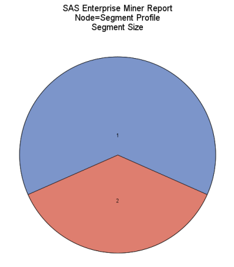

# INFS 5102 – Unsupervised Methods in Analytics

## Assignment 1: Cluster Analysis

    Enna Huang
---

## Background

In the domain of unsupervised learning, a cornerstone technique is data clustering which serves a crucial role in parsing extensive datasets into coherent and distinct groups, thereby facilitating the discovery of hidden patterns. Originating in 1955, the K-means algorithm stands as a seminal method in this field, showcasing the complexity involved in devising a universal clustering algorithm (Jain, 2010). Despite its longevity, the algorithm's capability to group data based on inherent similarities or properties, without leaning on predetermined labels, has kept it relevant, distinguishing it starkly from supervised learning methods.

To elucidate this concept, consider a classroom of students categorized by their preferences for subjects such as mathematics, science, or arts. This strategic grouping enables tailored educational strategies, enhancing learning efficacy. Similarly, in data science, clustering segregates data with analogous attributes into clusters, facilitating more detailed and focused analysis.

The K-means algorithm employs the Euclidean distance formula to segregate data entities into clusters based on intrinsic similarities. Figure 1 provides a visual representation of the algorithm's operation, starting with the arbitrary selection of K data objects as initial cluster centers. A repetitive loop assigns data objects to the nearest cluster, determined by the mean value of the objects within that cluster. This process continues until equilibrium is achieved, indicating the formation of optimal clusters.

The mathematical representation of the Euclidean distance formula is expressed as:

\[ d(x, y) = \sqrt{\sum_{i=1}^{n} (x_i - y_i)^2} \] 

Despite its apparent simplicity, the algorithm faces challenges, particularly in delineating clusters and selecting relevant features, both of which significantly impact clustering performance. 

**Figure 1.** This flowchart outlines the K-means clustering algorithm. Initially, k data objects are chosen as initial cluster centers. Then, in a repetitive loop, data objects are reassigned to the cluster that they most closely resemble, based on the mean value of objects within that cluster. The loop persists until no further changes occur, indicating the optimal clusters have been identified.

In contemporary applications, the K-means algorithm finds profound utility in medical diagnostics, where it distinguishes between benign and malignant tumors with remarkable precision, enabling early interventions and diagnoses (Soumyalatha et al., 2023). Current research focuses on determining the optimal number of clusters, integrating K-means with other clustering techniques, and assessing them through various validation metrics, including connectivity, Dunn, and Silhouette indices (Punyaban et al., 2022).

(Punyaban et al., 2022)
**Figure 2.** This diagram depicts the procedures to identify the optimal number of clusters (K-value) using various methods like the Elbow method, Gap Statistic, and Silhouette method. 

Anticipating the future, the focus is on developing models and algorithms capable of handling vast and heterogeneous datasets, exploring possibilities in clustering ensembles, semi-supervised clustering, and large-scale clustering. This trajectory aims to adapt to the increasing diversity in data types and complexities inherent in both structured and unstructured data formats (Jain, 2010).

---

## Cluster analysis with SAS Enterprise Miner

 
**Figure 1.** Process flow diagram of the cluster analysis with SAS Enterprise Miner. See appendix for metadata.

### Data Overview (StatExplore)

**Table 1.** Data Overview.

| Variable               | Mean   | Standard Deviation | Missing | Median | Skewness | Kurtosis |
|------------------------|--------|--------------------|---------|--------|----------|----------|
| Bare_Nuclei            | 3.54   | 3.64               | 16      | 1.00   | 0.99     | -0.80    |
| Bland_Chromatin        | 3.44   | 2.44               | 0       | 3.00   | 1.10     | 0.18     |
| Clump_Thickness        | 4.42   | 2.82               | 0       | 4.00   | 0.59     | -0.62    |
| Marginal_Adhesion      | 2.81   | 2.86               | 0       | 1.00   | 1.52     | 0.99     |
| Mitoses                | 1.59   | 1.72               | 0       | 1.00   | 3.56     | 12.66    |
| Normal_Nucleoli        | 2.87   | 3.05               | 0       | 1.00   | 1.42     | 0.47     |
| S_E_Cell_Size          | 3.22   | 2.21               | 0       | 2.00   | 1.71     | 2.17     |
| Uniformity_Cell_Shape  | 3.21   | 2.97               | 0       | 1.00   | 1.16     | 0.01     |
| Uniformity_Cell_Size   | 3.13   | 3.05               | 0       | 1.00   | 1.23     | 0.10     |

 
**Figure 2.** These histograms depicts the distribution of the raw data.

### Data Pre-processing

The preprocessing steps aim to enhance the quality of the data and improve the effectiveness of the subsequent cluster analysis. Each step has been carefully selected and justified to ensure that the data is in an optimal state for meaningful segmentation and analysis.

#### Imputation of Missing Values (Impute)

The choice of Distribution Imputation for the Bare_Nuclei feature was made due to several factors: Sample code numbers are nominal, all data are interval variables, the Bare_Nuclei feature has missing values, and the distribution of the Bare_Nuclei feature is right-skewed but appears bimodal. Distribution Imputation is chosen as it can preserve the statistical properties of complex data distributions more accurately compared to median imputation.

**Table 2.** imputation summary.

| Variable Name | Impute Method | Imputed Variable | 
|---------------|---------------|------------------| 
| Bare_Nuclei   | DISTRIBUTION  | IMP_Bare_Nuclei | 

| Measurement | Role  | Missing for TRAIN | 
|------------|-------|-------------------| 
| INTERVAL    | INPUT | 16                |

The variable Bare_Nuclei is imputed using the Distribution method. The imputed variable is named IMP_Bare_Nuclei. Bare_Nuclei is an input variable and is missing for 16 observations in the training data. The choice of Distribution Imputation was made to accurately capture the complexity of the data distribution.

#### Transformation of Data (TransformVariables)

In the data preprocessing stage, we applied a logarithmic transformation, specifically the natural logarithm (ln), to address right-skewness in the data. This transformation is a common technique used to normalize data distributions, particularly for variables that exhibit positive skewness. It works by spreading out values in the lower range while compressing values in the higher range. The formula used is as follows:

\[ \text{log}(x/\text{total}-x) \]

This transformation was chosen to ensure that the data conforms to the assumptions of normality required by some clustering algorithms, allowing for more robust and accurate analysis.

### Segments Analysis (Cluster)

> For each of the experiment, the NumberClusterMethod is changed to 6, 5, 4, 3, 2 and AUTOMATIC. The results are shown in the following sections.

#### 6 Segments Analysis and 5 Segments Analysis:

- **6 Segments Analysis:**
  
 | 
--- | --- 

**Figure 3.** Pie charts illustrate the distribution of data across six segments, highlighting the worth of each variable in these segments.

1. **Frequency Distribution**:
   - Segment 4 is the most populous, encompassing 30.19% of the total, followed by segments 3 and 5 (each with 16.45%), segment 2 (16.17%), segment 6 (12.02%), and segment 1 (8.73%).
   
2. **Variable Importance**:
   - Segment 4: The most significant variable is `Clump_thickness` with a worth of 0.31, followed by `Bare_nuclei` and `Uniformity_cell_size`.
   - Segment 3: The top variables are `Mitoses`, `Bland_chromatin`, and `Single_epithelial_cell_size`, with respective worth values of 0.10, 0.08, and 0.07.
   - Segment 5: `lgt_Mitoses` has the highest worth (0.14).
   - Segment 2 emphasizes `Bland_chromatin` (worth of 0.15) followed by `Clump_thickness` and `Mitoses`.
   - Segment 6: The most crucial variable is `Marginal_adhesion` with a worth of 0.09.
   - Segment 1 values `Bare_nuclei` the most, having a worth of 0.07.

- **5 Segments Analysis:**

 | 
--- | --- 

**Figure 4.** Pie charts illustrate the distribution of data across five segments, highlighting the worth of each variable in these segments.

1. **Frequency Distribution**:
   - Segment 2 dominates with 33.62%, followed by segment 5 (29.76%), segment 4 (18.60%), segment 3 (10.30%), and segment 1 (7.73%).
   
2. **Variable Importance**:
   - Segment 2: `Bland_chromatin` is the most valuable variable with a worth of 0.20.
   - Segment 5: The top variables in terms of worth are `Single_epithelial_cell_size` (0.12) and `Bland_chromatin` (0.12).
   - Segment 4 places the highest worth on `Mitoses` (0.14).
   - Segment 3: `Bare_nuclei` is the most significant variable with a worth of 0.10.
   - Segment 1: The most important variable is `Marginal_adhesion` with a worth of 0.06.

#### 4 Segments Analysis and 3 Segments Analysis:

- **4 Segments Analysis:**

 | 
--- | --- 

**Figure 5.** Pie charts illustrate the distribution of data across four segments, highlighting the worth of each variable in these segments.

  1. Frequency Distribution:
     - Segment 2 is the most populous, encompassing 36.34% of the total, followed by segment 1 (30.47%), segment 4 (21.60%), and segment 3 (11.59%).

  2. Variable Importance:
      - Segment 2: The most significant variable is `Bland_chromatin` with a worth of 0.26, followed by `Uniformity_cell_shape`, `Uniformity_cell_size`, and `Mitoses`.

      - Segment 1: In this segment, `Bland_chromatin` takes the lead in importance with a worth of 0.17. It is followed by `Mitoses`, `Single_epithelial_cell_size`, and `Normal_nucleoli`.

      - Segment 4: `Normal_nucleoli` is the most significant variable in this segment, with a worth of 0.15. Following closely are `Mitoses`, `Uniformity_cell_size`, and `Single_epithelial_cell_size`.

      - Segment 3: In the smallest segment, `Bare_nuclei` stands out as the most important variable, with a worth of 0.10. Other notable variables include `Normal_nucleoli`, `Mitoses`, and `Single_epithelial_cell_size`.

- **3 Segments Analysis:**

 | 
--- | --- 

**Figure 6.** Pie charts illustrate the distribution of data across three segments, highlighting the worth of each variable in these segments.

  1. Frequency Distribution:
       - Segment 1 dominates with 52.65% of the data, followed by segment 3 (27.32%) and segment 2 (20.03%).

  2. Variable Importance:
      - Segment 1: `Mitoses` holds the highest worth at 0.20, making it the most significant variable in this segment. It is closely followed by `Bare_nuclei`, `Marginal_adhesion`, and `Single_epithelial_cell_size`.

      - Segment 3: In segment 3, `Mitoses` takes the lead again, with a worth of 0.20.

      - Segment 2: `Marginal_adhesion` emerges as the most important variable in segment 2, with a worth of 0.11.

**Figure 6.1.** Histograms of the 3 segments analysis show the distribution of the data. 

#### 2 Segment Analysis and Detailed Segmentation Analysis by Automatic Segmentation

- **2 Segment Analysis**

 | 
--- | --- 

**Figure 7.** Pie charts of the 2 segments analysis show the segment size. The worth of each variable is shown in the figure.

The first section of the data reveals a segmentation into two groups, where:

  -  Segment 1 constitutes 63.52% of the total, and 
  -  Segment 2 makes up the remaining 36.48%. 

For both segments, the decision tree importance profiles are identical, with variables ranked in the following order:

1. `Mitoses`
2. `Uniformity_cell_shape`
3. `Bare_nuclei`
4. `Uniformity_cell_size`
5. `Normal_nucleoli`
6. `Single_epithelial_cell_size`
7. `Clump_thickness`
8. `Marginal_adhesion`
9. `Bland_chromatin`

**Figure 7.1.** Histograms of the 2 segments analysis show the distribution of the data. The worth of each variable is shown in the figure. The distribution of the data is not similar although the worth of each variable is similar.

- **Automatic Segmentation Analysis**

 | 
--- | --- 

**Figure 8.** pie chart of the SAS EM Automatic Segmentation . The worth of each variable is shown in the figure.

The more detailed segmentation presents a complex breakdown with segments having varying counts. Here, the decision tree importance profiles vary greatly, indicating more detailed insights into the segmentation. Each segment has a unique ranking of the variable worth, illustrating different characteristic features for each segment.

For example, segment 11 (18.60% of total) indicates `Clump_thickness` as the highest-ranked variable, while segment 1 (16.88% of total) shows `Mitoses` as the highest worth variable. This pattern is consistent, with each segment illustrating a unique profile, indicating a diverse dataset with complex patterns.

--- 

## Result discussion 

### Interpretation of the Results 

- Cluster Node:
The Cluster Node segregates the data into distinct groups based on variable similarities within the dataset. Different runs, ranging from 6-segment to automatic-segment analyses, unveil various data patterns and relationships by displaying unique segment distributions.

- Segment Profile Node:
These node facilitates understanding the importance of variables within each segment. Through this, we can infer the prominent variables that are influential in the segmentation process. For instance, in the 6-segment analysis, `Clump_thickness` in segment 4 holds the highest worth, indicating its significant role in defining that particular segment.

- Frequency Distribution and Variable Importance:

  Understanding the frequency distribution and variable importance is central to cluster analysis for several reasons:

  - **Identifying Key Features:** It helps in identifying the key features that are instrumental in grouping the data, can be crucial for further analyses or predictive modelling.

  - **Understanding Data Structure:** Understanding the frequency distribution helps in understanding the inherent structure of the data, revealing potential natural groupings or patterns.

  - **Optimizing Cluster Number:** Comparing results from different numbers of clusters, including automatic cluster determination, can help in identifying the optimal number of clusters that represent the data adequately without over / under-segmentation.

  - **Tailoring Strategies:** In real-world applications, these insights can be used to tailor strategies to specific groups identified by the clusters.

  1. **Frequency Distribution:** This concept demonstrates how data points populate each segment, a critical aspect in comprehending population dispersion across various segments. For instance, a noticeable shift from a balanced distribution in the 6-segment analysis to a concentrated pattern in the 2-segment analysis reveals potential natural groupings in the data, possibly emanating from the binary target variable.

  2. **Worth:** Worth values are provided for each variable within the segments, representing the significance of those variables in each context. Higher worth values indicate greater importance of a variable within a specific segment.

  3. **Variable Importance:** This parameter illustrates the significance of individual variables in segment structure. In various segment analyses, the prominence of variables like Mitoses, Bland_chromatin, and Bare_nuclei denotes their essential role in driving data segmentation, which could be instrumental in predictive modeling or further analyses.

#### Comparison of Results and Optimal Cluster Number

- **User-Specified Number Comparison:**
  The adjustment in cluster numbers redistributes data points, potentially modifying the insights extracted from the data, as evidenced by shifts in majority population segments.

- **Automatic Clustering by SAS EM:**
  SAS EM, using the Cubic Clustering Criterion (CCC), identified 3 as the optimal cluster number, striking a balance between detailed segmentation and over-segmentation, thus avoiding data concentration observed in 2-cluster and 6-cluster analyses. 
  The Cubic Clustering Criterion (CCC) is a measure used to determine the optimal number of clusters in a dataset. When set to 3 in Automatic Segmentation, the algorithm considers solutions with different cluster numbers, calculating CCC values for each. The CCC-CUTOFF value indicates that the algorithm likely identified 3 as the optimal number of clusters, indicating that dividing data into 3 clusters best represents the underlying patterns.

 
**Figure 9.** The CCC plot with Ward’s method, indicating a CCC-CUTOFF of 3, suggests that a 3-cluster solution optimally represents underlying data patterns.

- **Clustering Results Analysis and Selection of Optimal Clustering Result:**

    In judging the results produced by SAS EM, considering both the distribution of data across segments and the worth of variables within segments is imperative. A comprehensive evaluation involve considering the variable importance in determining the most representative variables in the segmentation and analyzing the segment distribution to gauge the balance in data distribution across segments.

    Determining the optimal clustering result involves a careful evaluation of both the depth of insights obtained and the complexity of the model. A model with more segments might provide nuanced insights but might also verge on over-segmentation, making interpretations complex. Conversely, a model with fewer segments might not reveal nuanced patterns in the data. Hence, selecting an optimal number would involve striking a balance, possibly aligning with the CCC determined by the automatic segmentation in SAS EM, which in this case suggests 3 as the optimal number of clusters.

#### 2 Segment and Automatic Segmentation result Analysis:

  1. **Uniformity in Two-Segment Analysis**: The two-segment analysis shows uniform decision tree importance profiles. This may indicate that the segmentation is too coarse to reveal nuanced insights, as seen in the detailed segmentation. Further analysis could explore the reasons behind this uniformity and determine whether a two-segment approach is adequate.

  2. **Complexity in Detailed Segmentation**: The detailed segmentation uncovers a rich complexity in the data, offering a more nuanced view of the variables' importance in different segments. This could potentially lead to more targeted analysis and understanding of the data.

  3. **Variable Significance**: Variables such as `Mitoses`, `Uniformity_cell_shape`, and `Bare_nuclei` appear frequently as high-worth variables across different segments, indicating their significant role in the data segmentation.

  One notable observation is the complexity of the data, as revealed in the detailed segmentation. Different segments exhibit unique profiles, emphasizing the significance of certain variables in specific contexts. For instance, `Mitoses`, `Uniformity_cell_shape`, and `Bare_nuclei` consistently emerged as high-worth variables across multiple segmentations, highlighting their importance in characterizing distinct data subsets. The choice of segmentation, whether coarse or detailed, depends on the specific objectives of a data science project. A more granular segmentation can lead to a deeper understanding of the data's underlying patterns, potentially informing more targeted analysis and decision-making.

--- 

## In-depth discussion of the results with respect to the real world problem

The current data analysis effort, facilitated by SAS EM, has enabled the segregation of breast cancer data into discernable clusters based on various critical attributes. When we relate these findings to the ongoing efforts in breast cancer research, the clusters can potentially signify different groups of patients having distinct patterns concerning the development and progression of the disease. To delineate the characteristics and implications of these clusters, an in-depth exploration of the attributes in the dataset is essential, backed by literature survey, particularly in the context of breast cancer diagnosis.

In the context of breast cancer, a disease identified as the most prevalent malignancy among women globally, understanding the distinctive characteristics of different clusters is vital (Soumyalatha et al., 2023). This task involves investigating the commonalities within the samples in the same cluster and identifying how they differ from other clusters. For instance, examining variables such as `Mitoses`, `Uniformity_cell_shape`, and `Bare_nuclei`, which emerged as significant in the clustering process, can potentially reveal insights into the different stages or aggressiveness of the tumors.

### Practical Implications

The k-means algorithm, a prominent data clustering technique, has shown considerable effectiveness in distinguishing between benign and malignant cells, providing clarity on the specific type of cancer a patient is grappling with (Soumyalatha et al., 2023). This strategy, as described in the research, is capable of achieving an accuracy rate exceeding 85% in tumor classification. These findings can have significant implications in the real world, especially in early diagnosis and personalized treatment plans.

The data obtained from the clusters can serve as a valuable resource in enhancing the predictive accuracy of current models. Notably, the segmentation insights can be leveraged to tailor specific strategies to predict the onset of the disease earlier, facilitating timely intervention and treatment. Moreover, understanding the distinctive attributes of different clusters can guide in fine-tuning the therapeutic approaches, focusing on the individual characteristics of the tumor types identified within each segment.

In conclusion, the current cluster analysis, juxtaposed with the findings from the cited literature, underscores the potential of data science techniques in revolutionizing breast cancer diagnosis. Through continuous exploration and collaboration between data scientists and healthcare professionals, there lies the promise of developing strategies that are both insightful and actionable, ultimately steering towards a future where breast cancer can be diagnosed and treated with greater precision and efficacy.

--- 

## Reflection 

During the tenure of this assignment, an analytical endeavor was undertaken, characterized by methodical exploration and synthesis of data through various sections of the report. The insights gleaned from each phase are illuminated below, interweaving personal experiences, especially focusing on the strengths and shortcomings of utilizing k-means clustering and SAS Enterprise Miner for data analysis.

### K-Means Clustering

#### Pros:
- **Granular Insights**: The utilization of the k-means clustering algorithm facilitated in-depth insights into the dataset, unveiling patterns and trends which served as ground for further analysis.
- **Optimizable Parameters**: The ability to optimize cluster number (K-value), which allowed for fine-tuning the analysis to yield more precise results.

#### Cons:
- **Initial K-value Determination**: From the personal interaction with the algorithm, it was observed that determining an optimal initial K-value required an extensive methodological approach, which could potentially be time-consuming.
- **Sensitivity to Initialization**: The k-means algorithm exhibited a high sensitivity to initialization, thereby demanding meticulous planning and execution to avoid sub-optimal clustering results.

### SAS Enterprise Miner

#### Pros:
- **Integrated Workflow**: SAS EM offering an integrated workflow that streamlined the processes of data imputation, transformation, and segment analysis, thereby enhancing efficiency in data management and analytics.
- **Analytical Depth**: SAS EM facilitated a nuanced analysis, where data translated to actionable insights.

#### Cons:
- **System Timeout Issues**: A critical drawback encountered during the assignment was the frequent timeouts experienced while using SAS EM. This not only disrupted the workflow but led to the loss of substantial work, necessitating the rebuilding of the project from scratch multiple times.
- **Limited Control Over Data Mining Process**: Compared to Python-based solutions utilizing local GPU resources, SAS EM appeared to offer less control over the data mining process, which sometimes resulted in cumbersome and time-consuming adjustments to achieve desired outcomes.

### Lessons Learned:

- **Data Preprocessing Importance**: The assignment underscored the vital role that data preprocessing plays in ensuring the authenticity and reliability of analytical results.
- **Iterative Analysis for Accuracy**: The necessity for an iterative approach in data science was highlighted, aiming for the most accurate and insightful results through continuous analysis and refinement.

This assignment served as a substantial learning experience, deepening comprehension of the k-means algorithm and the functionalities housed within SAS Enterprise Miner. The journey through various sections of the report demonstrated the transformation of theoretical knowledge into practical application. The experience cultivated a deeper appreciation for the cohesive narrative built through each analytical step, steering towards insightful and actionable outcomes. Despite the setbacks faced, the assignment reinforced the resilience and adaptive strategies required in the data science domain.

---

## References

1. A. K. Jain, "Data Clustering: 50 Years Beyond K-Means," *Pattern recognition letters*, vol. 31, no. 8, pp. 651, 2010.

2. C. Jie et al., "Review on the Research of K-means Clustering Algorithm in Big Data," in *2020 IEEE 3rd International Conference on Electronics and Communication Engineering (ICECE)*, 2020, pp. 107-111, doi: 10.1109/ICECE51594.2020.9353036.

3. N. Soumyalatha et al., "Breast Cancer Prediction Using Unsupervised Learning Technique K-Means Clustering Algorithm," in *2023 2nd International Conference on Vision Towards Emerging Trends in Communication and Networking Technologies (ViTECoN)*, 2023, pp. 1-6, doi: 10.1109/ViTECoN58111.2023.10157765.

4. P. Patel et al., "Approaches for finding Optimal Number of Clusters using K-Means and Agglomerative Hierarchical Clustering Techniques," in *2022 International Conference on Intelligent Controller and Computing for Smart Power (ICICCSP)*, 2022, pp. 1-6, doi: 10.1109/ICICCSP53532.2022.9862439.

5. W. Wolberg, "Breast Cancer Wisconsin (Original)," UCI Machine Learning Repository, 1992, doi: 10.24432/C5HP4Z.

---

## Appendix

### Metadata

The Breast Cancer Wisconsin dataset is used for classifying breast tumors into benign and malignant categories based on cytological characteristics obtained from fine-needle aspiration (FNA) biopsy images. Dr. William H. Wolberg from the University of Wisconsin Hospitals, Madison, curated this dataset to support the development of machine learning models capable of accurately predicting tumor malignancy([UCI Machine Learning Repository](https://archive.ics.uci.edu/ml/datasets/Breast+Cancer+Wisconsin+%28Original%29)).

This dataset comprises 699 instances, each corresponding to different patients, and includes the following 10 input variables:

1. **Sample code number**: ID number
2. **Clump Thickness**: Ranging from 1 to 10, indicating the thickness of clumps.
3. **Uniformity of Cell Size**: Ranging from 1 to 10, signifying variability in cell sizes.
4. **Uniformity of Cell Shape**: Ranging from 1 to 10, quantifying variation in cell shapes.
5. **Marginal Adhesion**: Ranging from 1 to 10, measuring the tendency of cells to stick together.
6. **Single Epithelial Cell Size**: Ranking the size of epithelial cells.
7. **Bare Nuclei**: Ranging from 1 to 10, representing the presence of nuclei not encapsulated by cytoplasm.
8. **Bland Chromatin**: Assessed between 1 and 10, denoting the uniformity of nucleus texture.
9. **Normal Nucleoli**: Signifying the prominence of nucleoli in cells.
10. **Mitoses**: Ranging from 1 to 10, representing the rate of cell division.
*The dataset also includes a binary target variable, Class (2 for benign, 4 for malignant).*
*(WIlliam 1992)*
