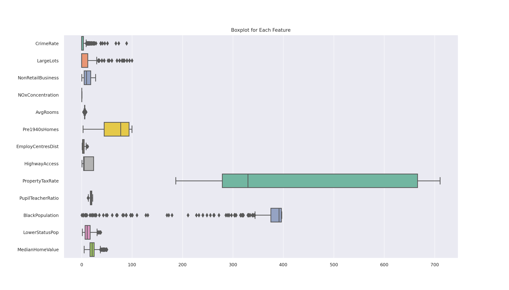
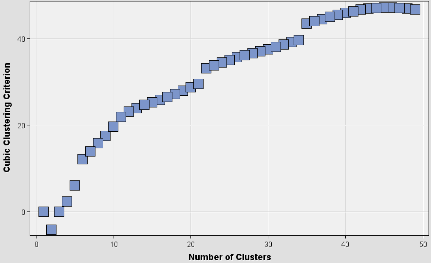
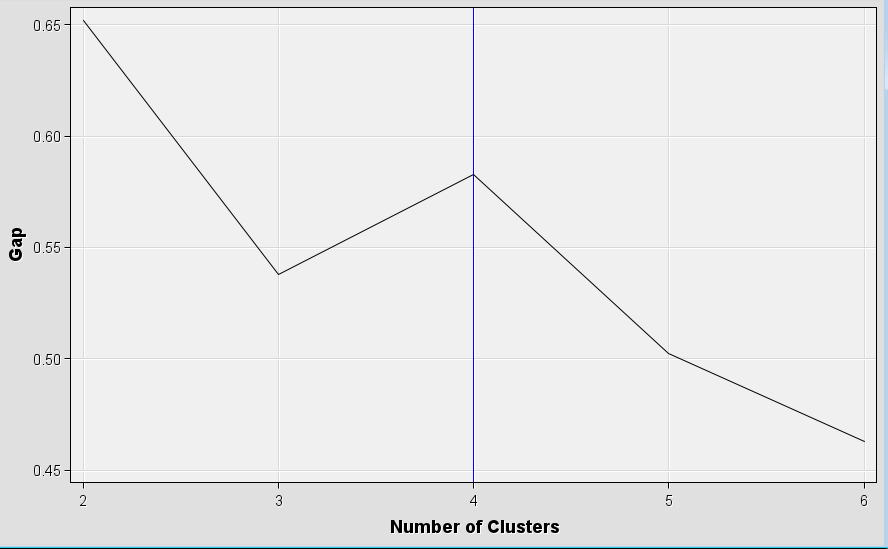
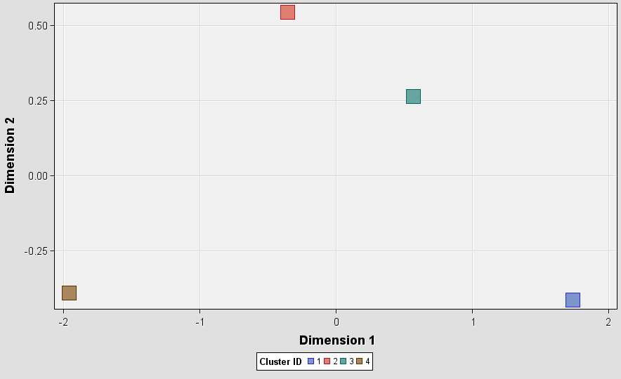
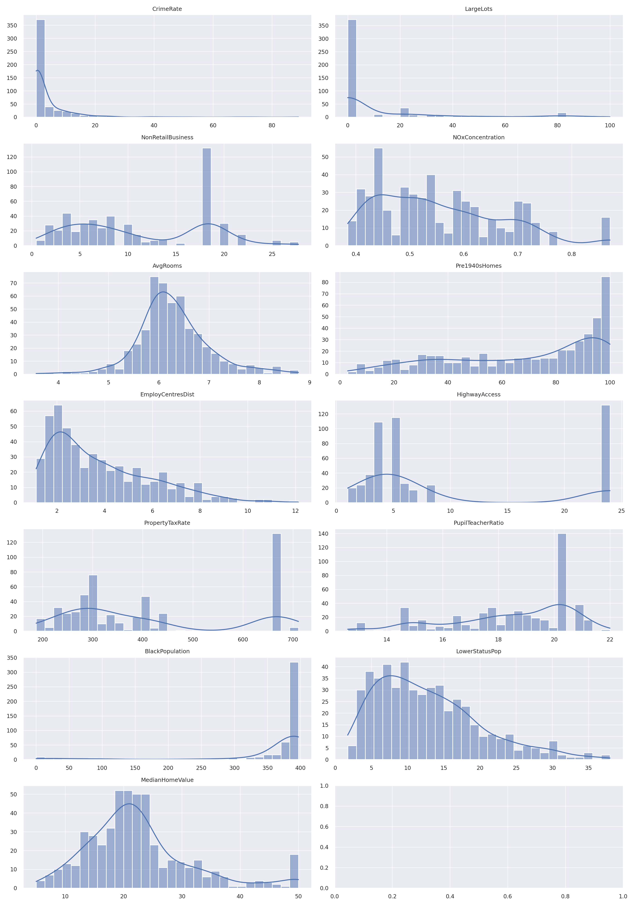

### Exploratory data analysis

 | 
--- | ---

In this particular boxplot, we observe various features which may represent data from a housing dataset given the context provided by the feature names such as "CrimeRate," "AvgRooms," and "MedianHomeValue." The boxplot indicates a significant spread and outliers in features like "CrimeRate," "PropertyTaxRate," and "LowerStatusPop." The feature "MedianHomeValue" seems to have a tight interquartile range relative to its range of values, suggesting less variability in the median prices of homes compared to the other features.

The second image is a correlation matrix heatmap, which illustrates the Pearson correlation coefficients between pairs of variables. The coefficients range from -1 to 1, where 1 means perfect positive correlation, -1 indicates perfect negative correlation, and 0 denotes no correlation.

From this heatmap, we can identify several notable correlations:
- A strong positive correlation between "PropertyTaxRate" and "HighwayAccess" (0.9), which might indicate that areas with higher tax rates have better access to highways.
- A strong negative correlation between "AvgRooms" and "LowerStatusPop" (-0.7), suggesting that houses with more rooms are less likely to be in areas with a higher proportion of lower-status population.
- "MedianHomeValue" is moderately positively correlated with "AvgRooms" (0.7) and moderately negatively correlated with "LowerStatusPop" (-0.7), which might imply that higher value homes tend to have more rooms and are located in areas with a smaller proportion of lower-status population.

The histogram show the distribution in detail and the missing value plot indicate there are a few missing values in the dataset,it looks not significant and only have single record in some columns. The missing values will be imputed in the data preprocessing step. these plots can be find in the appendix. section 1.1.1 and 1.1.2.

| Original Variable | Renamed Variable     | Description                                       |
|-------------------|----------------------|---------------------------------------------------|
| CRIM              | CrimeRate            | Per capita crime rate by town                     |
| ZN                | LargeLots            | Proportion of residential land zoned for large lots |
| INDUS             | NonRetailBusiness    | Proportion of non-retail business acres per town  |
| CHAS              | CharlesRiverDummy    | Charles River dummy variable (1 if tract bounds river) |
| NOX               | NOxConcentration     | Nitric oxides concentration (ppm)                 |
| RM                | AvgRooms             | Average number of rooms per dwelling              |
| AGE               | Pre1940sHomes        | Proportion of owner-occupied units built pre-1940 |
| DIS               | EmployCentresDist    | Weighted distances to Boston employment centres   |
| RAD               | HighwayAccess        | Index of accessibility to radial highways         |
| TAX               | PropertyTaxRate      | Full-value property-tax rate per $10,000          |
| PTRATIO           | PupilTeacherRatio    | Pupil-teacher ratio by town                       |
| B                 | BlackPopulation      | 1000(Bk - 0.63)^2 where Bk is the proportion of black population |
| LSTAT             | LowerStatusPop       | Percent lower status of the population            |
| MEDV              | MedianHomeValue      | Median value of owner-occupied homes in $1000's   |

---

SAS Enterprise Miner (SAS EM) is a comprehensive data mining and machine learning suite that can perform a wide range of tasks, including anomaly detection.

### 1. **K-means clustering using SAS EM**:
1. **Data Import**: Begin by importing your dataset (`a2-housing.csv`) into SAS EM.
   - Use the **Data Source** node to load your dataset into the project.
     - EDA for the dataset

1. **Data Preprocessing**:
   - **Standardize the Data**: Use the **Transform Variables** node to normalize or standardize the variables (features), making them have zero mean and unit variance.
   - For right-skewed columns (CRIM, ZN, DIS, RAD, LASTAT and MEDV), a log transformation was applied. For ZN, which had zero values, a constant of 1 was added before the transformation to avoid the log of zero.
   - For the left-skewed column (B) and (AGE), a Cube root transformation was applied.
   - After addressing skewness, all columns were normalized using Z-score normalization(Standardize in SAS EM).
   - impute missing values using the **Impute** node with the median imputation method.

   
2. **K-means Clustering**:
   - Use the **Cluster** and **HP Cluster** node and select k-means as the clustering method.
   - Configure the node to determine the number of clusters (you can specify or let SAS EM determine it based on data).
   - Run the clustering algorithm. Post execution, SAS EM assigns each data point to a cluster and calculates the distances of the points to their respective cluster centroids.

**2. Optimal Number of Clusters (k):** 
In the absence of a pre-specified number of clusters 'k', you can utilize the Elbow method or silhouette scores to ascertain the optimal 'k'. While SAS EM doesn't have a direct method named "Elbow", you can employ the **HP Cluster node** and inspect the **Cubic Clustering Criterion (CCC)**, **Pseudo F Statistic**, or **R-Squared** statistic. A noticeable kink in these plots can suggest the optimal number of clusters.

**3. Initialize Centroids:**
When you opt for the K-means clustering in SAS EM, it uses the **k-means++** initialization method by default, which is more advanced than random initialization.

The CCC plot basic model using Cluster node is shown below:

not ideal for this dataset. Try to use the **HP Cluster node** that can utilize the distance metrics like Euclidean and Manhattan. The distance metric can have a significant impact on the clustering results. The two most common distance metrics are Euclidean and Manhattan. The choice of distance metric depends on the data and the problem at hand.

1. **Euclidean Distance**:
    - It's the straight-line distance between two points in a Euclidean space.
    - More sensitive to changes in dimensions.
    - Often preferred when data is close to being normally distributed.
    - Given by the formula: \( \sqrt{ \sum_{i=1}^{n} (x_i - y_i)^2 } \)
  

 |
--- | --- 

2. **Manhattan Distance**:
    - It's the sum of the absolute differences between coordinates of paired data.
    - More robust to outliers compared to Euclidean distance.
    - Works well with data that isn't normally distributed or has more irregular structures.
    - Given by the formula: \( \sum_{i=1}^{n} |x_i - y_i| \)

 |
--- | --- 

- If certain columns in your dataset are not roughly normally distributed and you suspect the presence of outliers or irregular structures, the Manhattan Distance may be more appropriate because of its robustness to outliers.
  
- If the normalized features are roughly symmetrical and have minimal outliers, then the Euclidean Distance could be more appropriate.

Since the choice of distance metric can impact the results of clustering, it's also good practice to run clustering with both distance measures and compare the outcomes. Using internal validation metrics like Silhouette Score or Davies-Bouldin Index can assist in evaluating the quality of the clusters produced with each metric.

Compare the results based on cluster compactness, separation, and the Gap statistic. The one with higher Gap values would generally be more optimal.

**4. Perform k-means clustering:**
The actual clustering is executed when you run the **Cluster node**.

**5. Compute Standard Deviation and Density:**
After clustering, use the **Assessment node** to generate cluster statistics. It can provide details like cluster sizes, within-cluster distances (related to standard deviation), and more. If this doesn't cater to all your requirements, you might need to use the SAS code node to write custom SAS code.

export the results and leverage Python for subsequent steps. Python, with its expansive ecosystem of libraries like Pandas, NumPy, and Scikit-learn, offers flexibility and functionality to perform the tasks as outlined in the algorithm. 

### Step 2: Implement Anomaly Detection Steps

use the standard deviation and density factor calculations provided earlier to compute the anomaly scores. Then determine the threshold for anomaly detection and identify the anomalies.

The anomaly detection steps have been implemented, and anomalies in the dataset have been identified based on the calculated scores. Out of the dataset, 76 data points have been flagged as anomalies.

### Step 3: Reporting

#### Algorithm Implementation and Anomaly Detection

The designed algorithm was followed to detect anomalies in the given dataset. The steps included:

- **SAS EM Cluster Node**: The dataset was initially processed using the SAS EM Cluster node to perform k-means clustering. This step assigned each data point to a cluster and calculated the distance to the nearest centroid.
  
- **Python Analysis**: The processed data were then analyzed using Python. The standard deviation for each cluster (\( \sigma(C_i) \)) and the density factor (\( \rho(C_i) \)) were calculated. These calculations used the distance of points to their respective cluster centers provided by the SAS output.
  
- **Anomaly Score Calculation**: For each data point \( x \), the anomaly score \( A(x) \) was computed using the formula \( A(x) = \frac{D(x, C_i)}{\sigma(C_i) + \epsilon} \times \rho(C_i) \).
  
- **Threshold Determination**: A threshold was determined using a multiplier (\( \alpha \)) of the median anomaly score. Data points with an anomaly score higher than this threshold were flagged as potential anomalies.

#### Detected Anomalies

To visualize the anomaly detection process and the results, we can create the following:

1. **A 2D scatter plot** of the dataset with the anomalies clearly marked.
2. **A histogram or KDE plot** showing the distribution of anomaly scores with the threshold marked, to visualize where the anomalies lie in terms of their score.
3. **A table (confusion matrix)**, if true labels are available, to show how well the algorithm did in terms of false positives and false negatives. If true labels are not available, we can provide a summary table showing the count of detected anomalies per cluster.

Given that we are working with a multi-dimensional dataset, for visualization purposes we'll need to reduce the dimensionality. This can be done using Principal Component Analysis (PCA) to project the data onto 2D space for the scatter plot.

- The histogram on the left displays the distribution of anomaly scores across the dataset with a dashed red line indicating the threshold. Scores to the right of this line have been classified as anomalies.

- The scatter plot on the right shows the data projected onto the first two principal components from PCA. The blue points represent normal data points, while the red points indicate the detected anomalies.

 | 
--- | --- 

The summary table provides a breakdown of anomalies detected within each cluster:

| Cluster ID | Anomaly Count | Total Count | Anomaly Rate |
|------------|---------------|-------------|--------------|
| 1          | 49            | 141         | 34.75%       |
| 2          | 22            | 174         | 12.64%       |
| 3          | 5             | 191         | 2.62%        |

This table shows the number of detected anomalies ('Anomaly Count'), the total number of points ('Total Count'), and the rate of anomalies ('Anomaly Rate') in each cluster. Cluster 1 has a significantly higher anomaly rate compared to the other clusters, which could be indicative of a cluster that contains more outliers or is less cohesive than the others.

The detected anomalies are those data points with an anomaly score higher than the determined threshold. These data points are considered to deviate significantly from the cluster centroids, taking into account the cluster's standard deviation and density.

#### Data Pre-processing Justification

Pre-processing is critical in anomaly detection algorithms for several reasons:

- **Normalization/Standardization**: Attributes of the dataset were normalized or standardized to ensure that the anomaly detection algorithm is not biased by the scale of the data.
  
- **Transformation**: Skewed data were transformed to more closely approximate a Gaussian distribution, which is often assumed in statistical modeling.
  
- **Imputation**: Missing values were imputed to allow the algorithm to leverage the complete dataset, which provides a more accurate and robust analysis.
  
- **Advanced Initialization**: Using advanced methods such as k-means++ for initializing centroids helps in achieving a more reliable clustering outcome, which forms the basis for the anomaly detection.

The pre-processing steps taken using SAS EM, as well as the log and cube root transformations, were necessary to prepare the data for the k-means algorithm, ensuring that the clustering was not adversely affected by outliers, skewed distributions, or missing values.

### Appendix

 

