**Exploratory Data Analysis:**

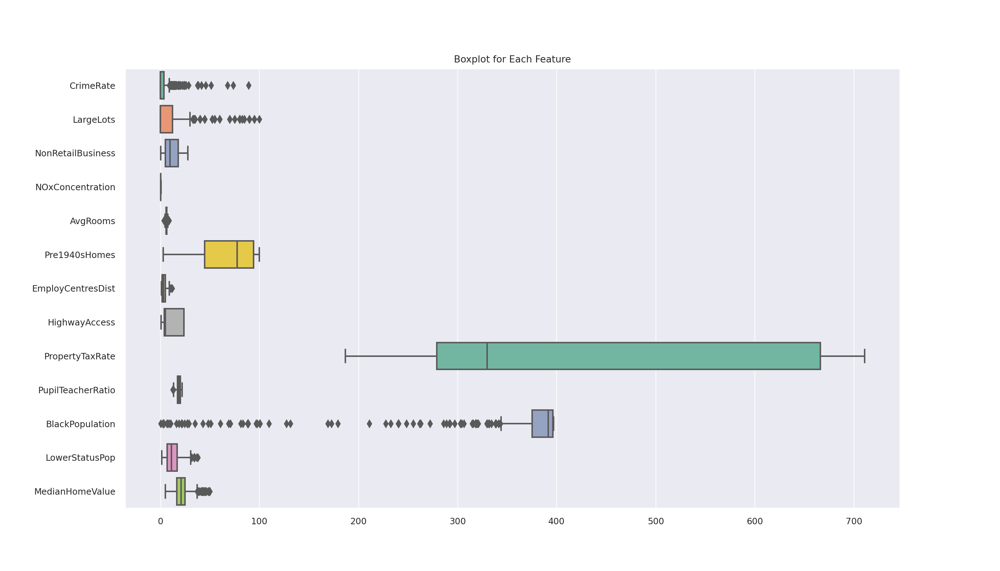 | 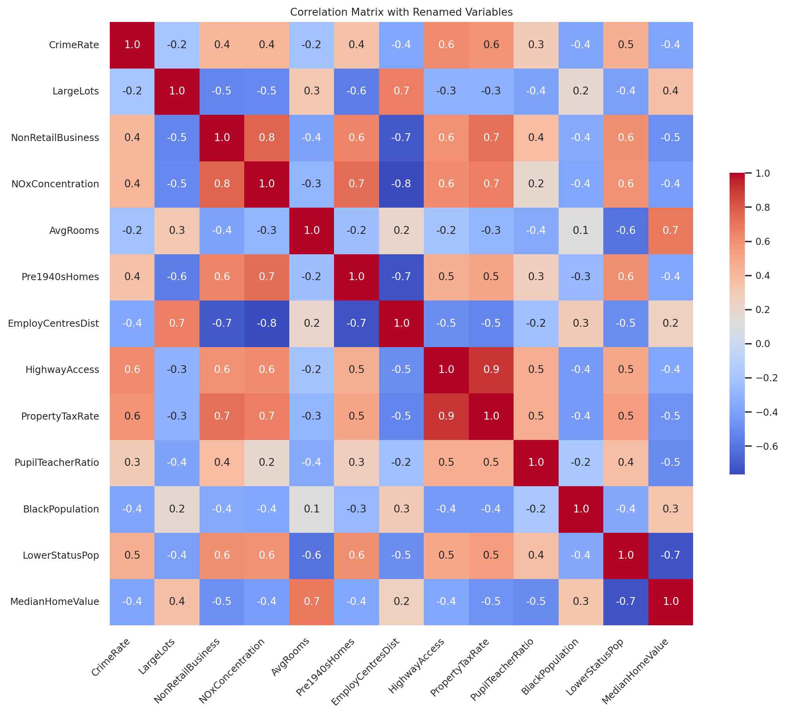
--- | ---

The boxplots reveal significant variability in the per capita crime rate by town (CrimeRate), with outliers suggesting extreme cases beyond the general crime pattern. The full-value property-tax rate per $10,000 (PropertyTaxRate) and the percentage of the population of lower status (LowerStatusPop) also exhibit a broad range and outliers, pointing towards significant disparities within towns. On the contrary, the median value of owner-occupied homes (MedianHomeValue) shows a more concentrated interquartile range, indicating less variability in home values across the dataset.

The correlation matrix heatmap provides insights into the relationships between features. A strong positive correlation exists between nitric oxides concentration (NOxConcentration) and the proportion of non-retail business acres per town (NonRetailBusiness), as well as between the full-value property-tax rate per $10,000 (PropertyTaxRate) and accessibility to radial highways (HighwayAccess), which may suggest that more accessible areas have higher tax rates. In contrast, weighted distances to Boston employment centres (EmployCentresDist) are negatively correlated with both the average number of rooms per dwelling (AvgRooms) and the percentage of lower status of the population (LowerStatusPop), hinting at a relationship between proximity to employment centres, housing size, and socio-economic status.

Detailed analysis of the distribution of each feature and the assessment of missing data points are crucial for understanding the underlying structure of the dataset. While a high-level overview is provided in the main text, readers interested in the complete histograms of feature distributions and the visualization of missing data points are directed to Appendix Section 1.1.1 for histograms and Section 1.1.2 for the missing value plot, respectively.

These findings guide further analysis, emphasizing features with substantial variance and interrelationships that could impact outlier detection and underlying socio-economic factors.

---

### **Application of K-means Clustering in SAS Enterprise Miner**:

0. The workflow diagram of the k-means clustering in SAS EM is shown below:

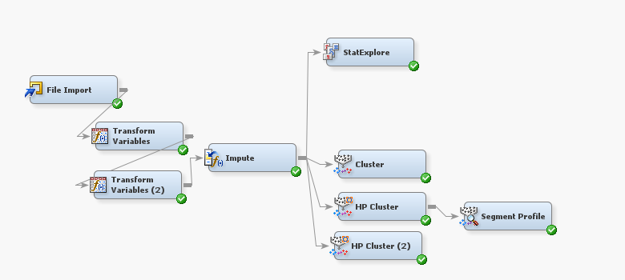

1. **Data Acquisition**:
   - The dataset `a2-housing.csv` is incorporated into the SAS Enterprise Miner framework using the **Data Source** node. This action ensures proper integration of data for ensuing preprocessing and analytical procedures.

2. **Data Preparation**:
   - **Feature Normalization**: The normalization of attributes is conducted through the **Transform Variables** node, standardizing the variables to a mean of zero and a unit standard deviation.
   - **Skewness Adjustment**:
     - Variables exhibiting right skewness (CRIM, ZN, DIS, RAD, LASTAT, and MEDV) undergo a logarithmic transformation to correct distributional asymmetries. For the ZN variable, which contains zero values, an increment by unity is applied before the logarithmic adjustment.
     - Variables with left skewness (B and AGE) are subjected to a cubic root transformation to ameliorate skewness, aiming for a distribution symmetry.
   - **Standardization**: Following transformation, a z-score standardization is performed to achieve a consistent scale across variables, a fundamental prerequisite for k-means clustering.

**Data Pre-processing Justification**

Pre-processing is critical in anomaly detection algorithms for several reasons:

- **Normalization/Standardization**: Attributes of the dataset were normalized or standardized to ensure that the anomaly detection algorithm is not biased by the scale of the data.
  
- **Transformation**: Skewed data were transformed to more closely approximate a Gaussian distribution, which is often assumed in statistical modeling.
  
- **Imputation**: Missing values were imputed to allow the algorithm to leverage the complete dataset, which provides a more accurate and robust analysis.
  
- **Advanced Initialization**: Using advanced methods such as k-means++ for initializing centroids helps in achieving a more reliable clustering outcome, which forms the basis for the anomaly detection.

The pre-processing steps taken using SAS EM, as well as the log and cube root transformations, were necessary to prepare the data for the k-means algorithm, ensuring that the clustering was not adversely affected by outliers, skewed distributions, or missing values.

1. **Clustering Execution**:
   - Utilization of the **Cluster** and **HP Cluster** nodes within SAS EM facilitates the k-means clustering algorithm. Determination of the optimal cluster quantity is a pivotal consideration, underpinned by the analysis of within-cluster sum of squares and silhouette scores, amongst other statistical metrics.
   - The nodes are configured to identify the most fitting cluster count, which can either be predefined or algorithmically determined by SAS EM based on the dataset properties.
   - Upon implementation, the algorithm categorizes each observation into a cluster, computing the proximities to the respective centroids.

**3.1. Determination of Optimal Cluster Count (k):**
   - **Identification of Optimal Cluster Number**: Gap statistic examination reveals an optimal clustering solution at \( k = 3 \), as evidenced by the peak in the initial graphical representation.

**3.2. Centroid Initialization:**
   - The **k-means++** method is utilized for centroid initialization, offering an enhancement over random initialization techniques.

**3.3. Assessment of the Cubic Clustering Criterion (CCC) Plot**:
   - The CCC plot derived from the basic model using the Cluster node suggests suboptimal performance for this specific dataset. An alternative consideration involves the **HP Cluster node**, which can harness various distance metrics like Euclidean and Manhattan, influencing clustering outcomes significantly.

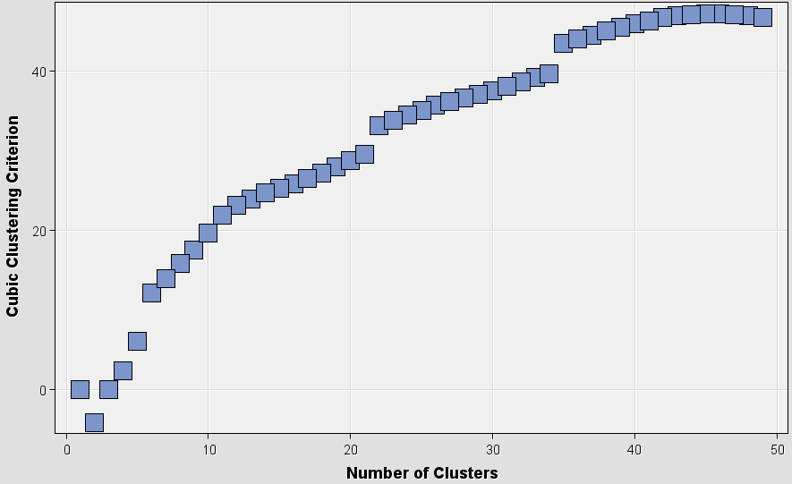

**Euclidean Distance**:
    - Characterized by the geometric shortest path between point pairs in Euclidean space.
    - More susceptible to changes in dimensionality.
    - Preferable for data approximating normal distribution.
    - The distance is computed as \( \sqrt{ \sum_{i=1}^{n} (x_i - y_i)^2 } \).

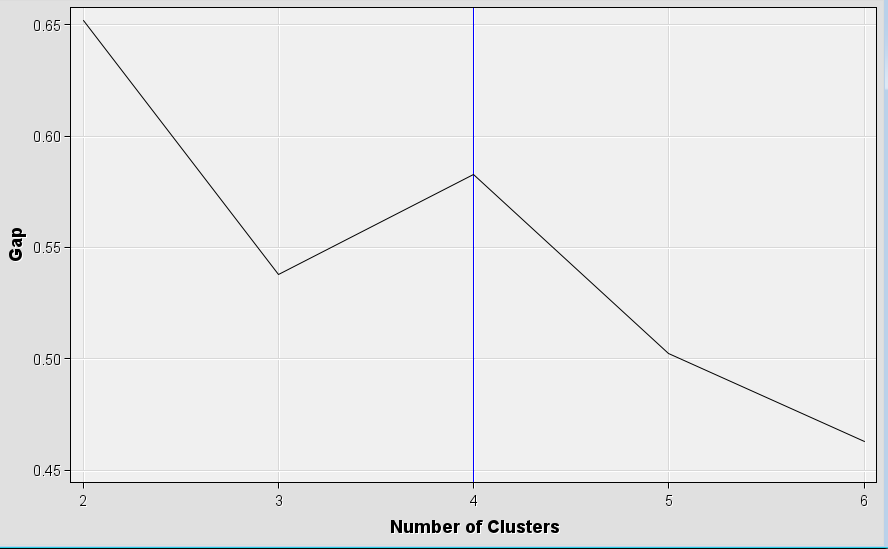

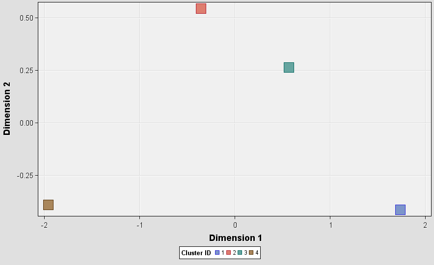 |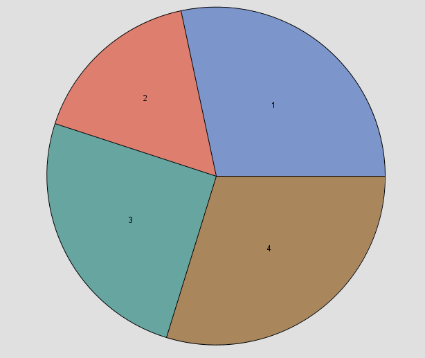
--- | --- 

**Manhattan Distance**:
    - Constitutes the aggregate of the absolute discrepancies between paired data coordinates.
    - Offers robustness against outliers in comparison to Euclidean distance.
    - Apt for data that deviates from normal distribution patterns or possesses more complex structures.
    - The distance is calculated as \( \sum_{i=1}^{n} |x_i - y_i| \).

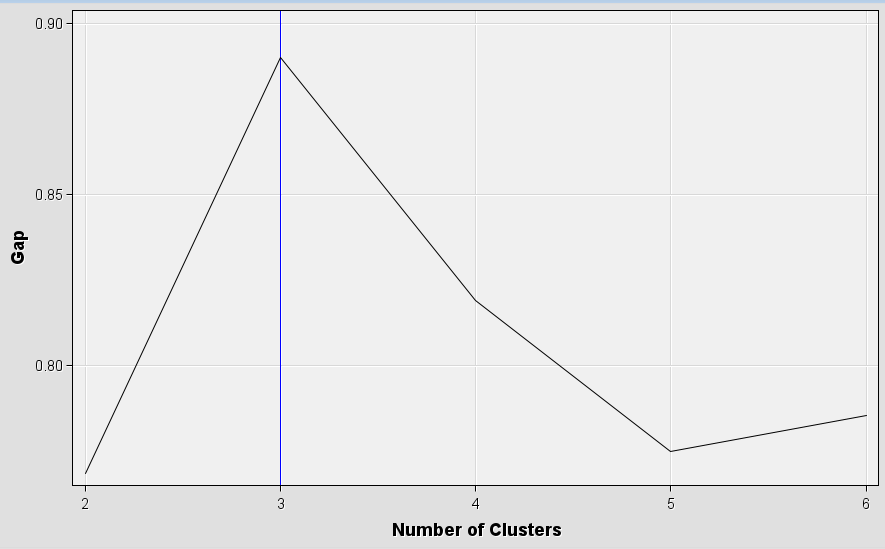

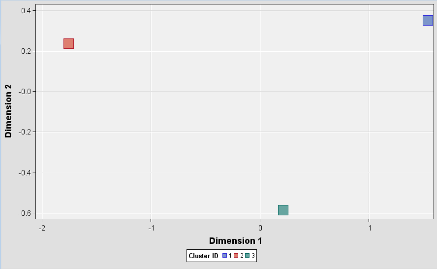 |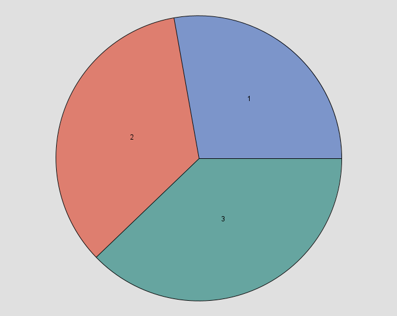
--- | --- 

Given the data characteristics, where a non-normal distribution is present or outliers are a concern, Manhattan Distance may be preferable due to its outlier resilience. Conversely, if the normalized features are approximately symmetrical with negligible outliers, Euclidean Distance might be more suitable.

**4. Implementation of K-means Clustering**:
   - The **Cluster node** is activated to perform the clustering process. Subsequent exportation of results for additional analysis is conducted with Python, leveraging its comprehensive libraries for data science tasks.

---

### Anomaly Detection with Advanced K-means Algorithm

Utilizing Python's scientific stack—Pandas for data manipulation, NumPy for numerical calculations, and Scikit-learn for machine learning—each step of the Advanced K-means Anomaly Detection algorithm is meticulously implemented. This approach takes into account both the standard deviation and density factor to ascertain the anomaly scores, leading to the identification of outliers within the dataset.

The dataset was preprocessed and partitioned into clusters with the initialization of centroids using the k-means++ algorithm. For each cluster \( C_i \), the standard deviation \( \sigma(C_i) \) and the density factor \( \rho(C_i) \) were calculated. These measures are pivotal in evaluating the deviation of each data point from its cluster centroid, contributing to the anomaly score determination.

**Anomaly Score Computation**

Each data point \( x \) in the dataset was assigned an anomaly score \( A(x) \), calculated using the equation \( A(x) = \frac{D(x, C_i)}{\sigma(C_i) + \epsilon} \times \rho(C_i) \). Here, \( D(x, C_i) \) represents the distance from \( x \) to its nearest cluster centroid, and \( \epsilon \) is a small constant to avoid division by zero.

**Dynamic Threshold and Anomaly Detection**

A dynamic threshold \( T \) was set as \( \alpha \) times the median of all calculated anomaly scores. Data points with scores exceeding this threshold were categorized as anomalies. Following this criterion, 76 data points were flagged.

#### Visualization and Summary of Anomalies

Dimensionality reduction via Principal Component Analysis (PCA) enabled the visualization of the multi-dimensional dataset. The histograms and scatter plots provided illustrate the distribution of anomaly scores and the spatial relation of anomalies to the normal data, respectively.

**Histogram and Scatter Plot Interpretations:**

- **Histogram**: Showcases the anomaly scores' distribution. The threshold is marked by a dashed red line, with scores beyond this indicating potential anomalies.
  
- **Scatter Plot**: Depicts data in a 2D space after PCA reduction. Normal data points are marked in blue, while anomalies are in red.

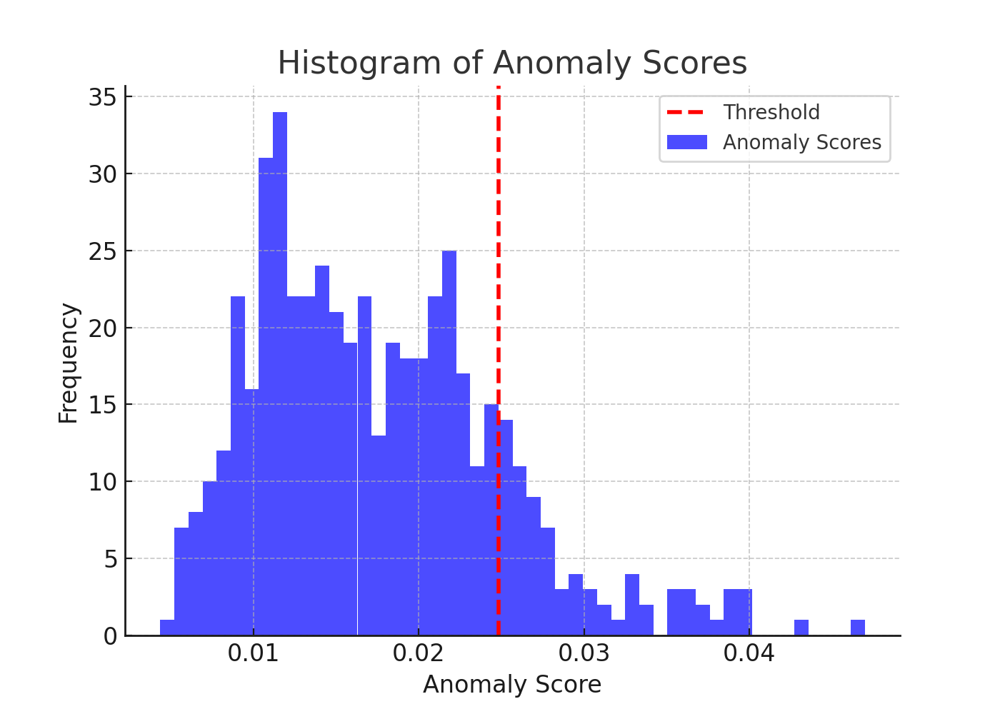 | 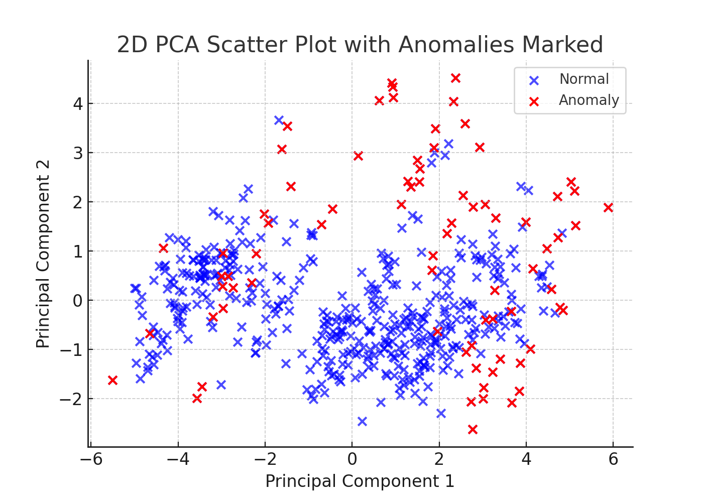
--- | --- 

**Anomaly Distribution Across Clusters:**

| Cluster ID | Anomaly Count | Total Count | Anomaly Rate |
|------------|---------------|-------------|--------------|
| 1          | 49            | 141         | 34.75%       |
| 2          | 22            | 174         | 12.64%       |
| 3          | 5             | 191         | 2.62%        |

The anomaly rate per cluster provides insights into the distribution of outliers, with Cluster 1 displaying a notably higher anomaly rate.

The algorithm successfully identifies data points with significantly divergent behavior from the cluster patterns, recognizing them as anomalies. The distinct deviation in Cluster 1's anomaly rate suggests varying cluster cohesion or the presence of a subgroup of outliers.

### Appendix

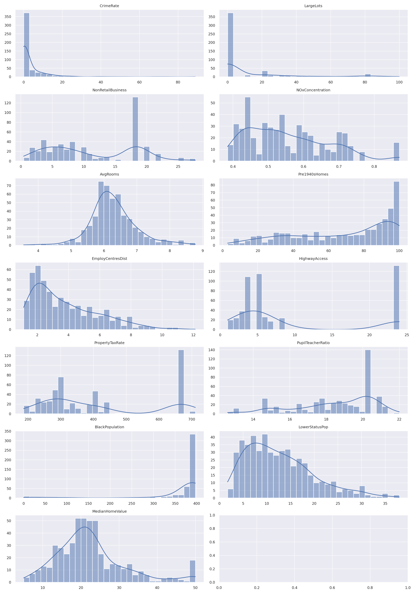 

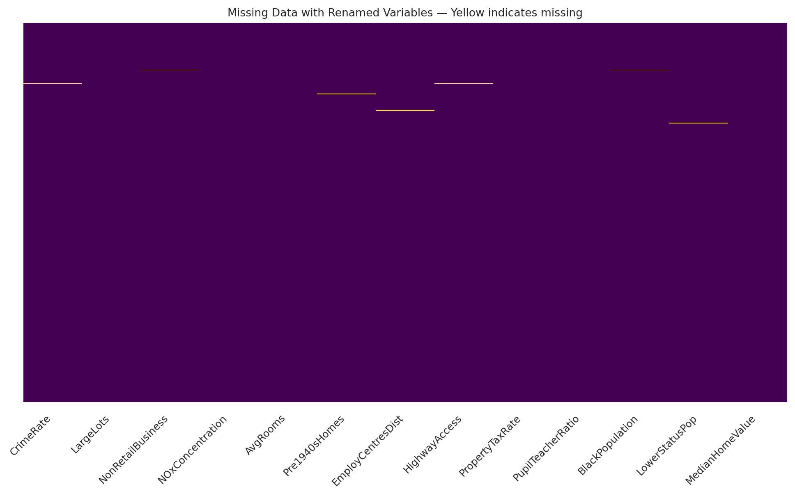

**Table 1: Feature Descriptions**

| Original Variable | Renamed Variable     | Description                                       |
|-------------------|----------------------|---------------------------------------------------|
| CRIM              | CrimeRate            | Per capita crime rate by town                     |
| ZN                | LargeLots            | Proportion of residential land zoned for large lots |
| INDUS             | NonRetailBusiness    | Proportion of non-retail business acres per town  |
| CHAS              | CharlesRiverDummy    | Charles River dummy variable (1 if tract bounds river) |
| NOX               | NOxConcentration     | Nitric oxides concentration (ppm)                 |
| RM                | AvgRooms             | Average number of rooms per dwelling              |
| AGE               | Pre1940sHomes        | Proportion of owner-occupied units built pre-1940 |
| DIS               | EmployCentresDist    | Weighted distances to Boston employment centres   |
| RAD               | HighwayAccess        | Index of accessibility to radial highways         |
| TAX               | PropertyTaxRate      | Full-value property-tax rate per $10,000          |
| PTRATIO           | PupilTeacherRatio    | Pupil-teacher ratio by town                       |
| B                 | BlackPopulation      | 1000(Bk - 0.63)^2 where Bk is the proportion of black population |
| LSTAT             | LowerStatusPop       | Percent lower status of the population            |
| MEDV              | MedianHomeValue      | Median value of owner-occupied homes in $1000's   |