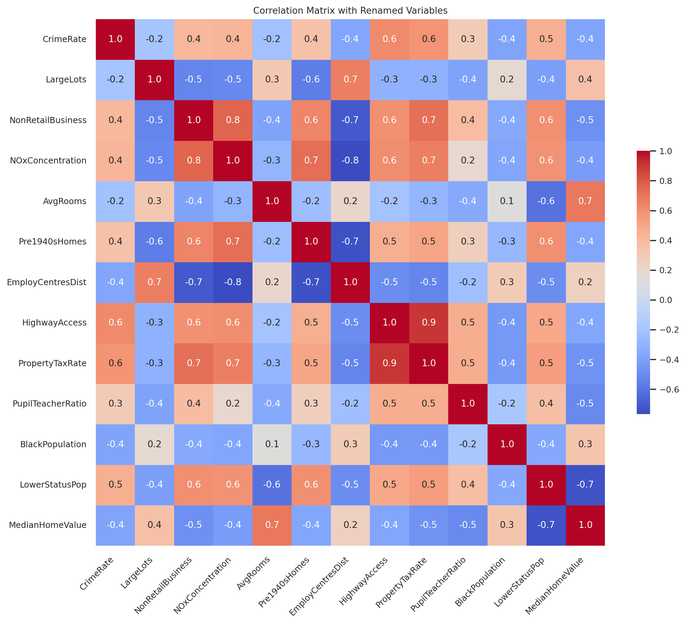
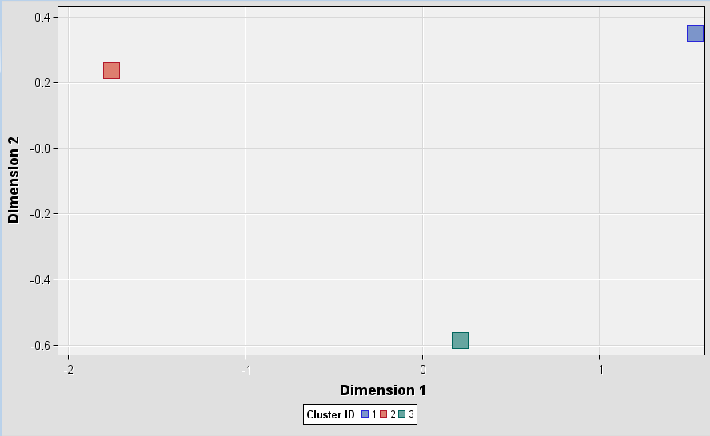

**Exploratory Data Analysis:**

 | 
--- | ---

Our exploratory analysis began with boxplots which showcased considerable variation, particularly in 'Crime Rate per Capita' and 'Property Tax Rate per $10,000'. These plots also highlighted outliers, suggesting potential anomalies. The 'Percentage of Lower Status Population' displayed a broad range of values, indicative of socio-economic diversity. Conversely, the 'Median Value of Owner-Occupied Homes' exhibited fewer extremes, although outliers were noted, pointing to atypical cases in the housing market.

The heatmap of correlations provided insight into relationships between features: a strong positive link was observed between 'Nitric Oxides Concentration' and 'Proportion of Non-Retail Business Acres', and between 'Property Tax Rate' and 'Accessibility to Radial Highways', suggesting a connection between commercial zoning and environmental conditions, as well as between highway access and tax rates. A negative correlation emerged between 'Weighted Distances to Five Boston Employment Centres', 'Average Number of Rooms per Dwelling', and 'Percentage of Lower Status Population', highlighting a possible association between proximity to employment centers, housing size, and socio-economic status.

For further detailed analysis, the Appendix 1 contain histograms for each feature distribution and visualizations of missing data. These findings from the EDA are crucial in guiding the further analysis and provide a foundation for understanding the data's socio-economic context.

---

### Algorithmic Implementation and Analysis

K-means clustering offers a robust approach to unsupervised machine learning, and its application within SAS Enterprise Miner allows for the efficient categorization of large datasets. The workflow for implementing k-means clustering comprises a series of structured steps that begin with data acquisition and culminate in the analysis of anomalies.

**Data Acquisition and Preparation**
The initial phase involves integrating the `a2-housing.csv` dataset into the SAS Enterprise Miner environment, facilitated by the Data Source node. This stage is crucial as it sets the foundation for subsequent preprocessing tasks. The preprocessing steps include normalization of attributes, using the Transform Variables node to ensure each variable operates on a uniform scale, typically with a zero mean and unit variance. Moreover, skewed variables undergo logarithmic and cubic root transformations to rectify distributional asymmetries and variance instabilities.

**Data Preprocessing Rationale**
The preprocessing phase is critical in anomaly detection, ensuring that all variables are comparably scaled and that the impact of outliers and non-normal distributions is minimized. This enhances the k-means algorithm's ability to discern patterns and groupings within the data more effectively.

**Clustering Execution and Evaluation**
The clustering process commences with the determination of the optimal number of clusters, leveraging the statistical rigor of the elbow method and silhouette scores within the Cluster and HP Cluster nodes. To avoid the pitfalls of random centroid initialization, the k-means++ method is employed, providing a methodological enhancement that facilitates more accurate clustering outcomes. The choice of distance metric is also considered, with the Euclidean distance being preferable for normally distributed data and the Manhattan distance offering resilience in the presence of outliers and non-normal distributions.

- Determination of Optimal Cluster Count (k):

The process of k-means clustering begins with the determination of the optimal number of clusters. The gap statistic method was applied, indicating an optimal cluster count of \( k = 3 \), which was substantiated by a clear peak in the graphical representation of within-cluster sum of squares against various k values. This peak signifies the point at which adding another cluster does not provide a substantial improvement in the total variance explained, hence \( k = 3 \) is determined to be the point of diminishing returns in this specific instance.

- Centroid Initialization:

The k-means++ method, a sophisticated alternative to random centroid initialization, was employed. This method systematically places initial centroids in a manner that they are statistically likely to be distant from each other, hence enhancing the probability of converging to a better local minimum than would be achieved by random initialization.

- Assessment of the Cubic Clustering Criterion (CCC) Plot:

An evaluation of the CCC plot from the basic model, as derived from the Cluster node, indicated suboptimal clustering performance for this dataset. The HP Cluster node was identified as a potential alternative, capable of employing various distance metrics, such as Euclidean and Manhattan distances, which can have a substantial impact on clustering outcomes.

**Distance Metrics Analysis**

- Euclidean Distance:

The Euclidean distance, the standard geometric measure in Euclidean space, is computed as \( \sqrt{ \sum_{i=1}^{n} (x_i - y_i)^2 } \). It provides an effective measure for datasets approximating a normal distribution but may be overly sensitive to changes in dimensionality.

 |
--- | --- 

- Manhattan Distance:

The Manhattan distance is calculated as \( \sum_{i=1}^{n} |x_i - y_i| \), reflecting the sum of absolute differences between coordinate pairs. This distance metric is less influenced by outliers and thus is better suited for datasets that deviate from normal distribution or that exhibit more complex structures.

 |
--- | --- 

Considering these metrics, the choice between Euclidean and Manhattan distances was based on the dataset characteristics. The Manhattan distance was favored due to its resilience to outliers and its applicability to the non-normal distribution observed in the dataset.

**K-means Algorithm in Python**
Subsequent to the clustering execution within SAS, the Python programming language serves as an advanced platform for the application of the k-means algorithm tailored for anomaly detection. Utilizing libraries such as Pandas, NumPy, and Scikit-learn, the algorithm is enhanced to include considerations for standard deviation and data point density within the clusters.

**Anomaly Detection and Interpretation**
Each data point receives an anomaly score calculated based on its proximity to the nearest cluster centroid, normalized by factors such as the cluster's density and standard deviation. This process entails setting a dynamic threshold to discern outliers effectively, with the identification of 76 data points as anomalies. Dimensionality reduction via Principal Component Analysis (PCA) facilitates the visual interpretation of these anomalies, permitting a comprehensive exploration through histograms and scatter plots.

**Anomaly Detection in K-means Clustering**

Post-cluster formation, the anomaly detection phase commenced. For each cluster \( C_i \), standard deviation \( \sigma(C_i) \) and density factor \( \rho(C_i) \) were computed. These metrics were instrumental in assessing the deviation of each data point from its cluster centroid, which in turn informed the anomaly score.

**Anomaly Score Computation**

Each data point \( x \) was evaluated using the formula \( A(x) = \frac{D(x, C_i)}{\sigma(C_i) + \epsilon} \times \rho(C_i) \), where \( D(x, C_i) \) denotes the distance from the point \( x \) to its nearest cluster centroid and \( \epsilon \) is a small constant ensuring non-zero division. This anomaly score reflects the degree to which each data point deviates from its cluster's typical data point distribution.

**Dynamic Threshold and Anomaly Detection**

The threshold \( T \) for anomaly detection was dynamically set at \( \alpha \) times the median of all the computed anomaly scores. Consequently, any data point with an anomaly score exceeding \( T \) was classified as an outlier. Employing this method, 76 data points were distinctly identified as anomalies, warranting further investigation.

**Visualization and Summary of Anomalies**

 | 
--- | --- 

Dimensionality reduction via Principal Component Analysis (PCA) enabled the visualization of the multi-dimensional dataset. The histograms and scatter plots provided illustrate the distribution of anomaly scores and the spatial relation of anomalies to the normal data, respectively.

**Histogram and Scatter Plot Interpretations:**

- **Histogram**: Showcases the anomaly scores' distribution. The threshold is marked by a dashed red line, with scores beyond this indicating potential anomalies.
  
- **Scatter Plot**: Depicts data in a 2D space after PCA reduction. Normal data points are marked in blue, while anomalies are in red.

**Anomaly Distribution Across Clusters:**

| Cluster ID | Anomaly Count | Total Count | Anomaly Rate |
|------------|---------------|-------------|--------------|
| 1          | 49            | 141         | 34.75%       |
| 2          | 22            | 174         | 12.64%       |
| 3          | 5             | 191         | 2.62%        |

The anomaly rate per cluster provides insights into the distribution of outliers, with Cluster 1 displaying a notably higher anomaly rate.

The algorithm successfully identifies data points with significantly divergent behavior from the cluster patterns, recognizing them as anomalies. The distinct deviation in Cluster 1's anomaly rate suggests varying cluster cohesion or the presence of a subgroup of outliers.

The implementation of an advanced k-means clustering algorithm within a Python environment, following the initial clustering in SAS Enterprise Miner, reveals critical insights into the dataset's structure. A noteworthy observation is the uneven distribution of anomalies across the clusters, suggesting variable levels of data homogeneity and the potential existence of outlier subgroups. This study underscores the advanced k-means algorithm's capacity to isolate outliers and contribute to a deeper understanding of the inherent complexities within the dataset.

---

### Appendix 1: Histograms and Missing Data

 

---

### Appendix 2: Feature Descriptions

**Table 1: Feature Descriptions**

| Original Variable | Renamed Variable     | Description                                       |
|-------------------|----------------------|---------------------------------------------------|
| CRIM              | CrimeRate            | Per capita crime rate by town                     |
| ZN                | LargeLots            | Proportion of residential land zoned for large lots |
| INDUS             | NonRetailBusiness    | Proportion of non-retail business acres per town  |
| CHAS              | CharlesRiverDummy    | Charles River dummy variable (1 if tract bounds river) |
| NOX               | NOxConcentration     | Nitric oxides concentration (ppm)                 |
| RM                | AvgRooms             | Average number of rooms per dwelling              |
| AGE               | Pre1940sHomes        | Proportion of owner-occupied units built pre-1940 |
| DIS               | EmployCentresDist    | Weighted distances to Boston employment centres   |
| RAD               | HighwayAccess        | Index of accessibility to radial highways         |
| TAX               | PropertyTaxRate      | Full-value property-tax rate per $10,000          |
| PTRATIO           | PupilTeacherRatio    | Pupil-teacher ratio by town                       |
| B                 | BlackPopulation      | 1000(Bk - 0.63)^2 where Bk is the proportion of black population |
| LSTAT             | LowerStatusPop       | Percent lower status of the population            |
| MEDV              | MedianHomeValue      | Median value of owner-occupied homes in $1000's   |