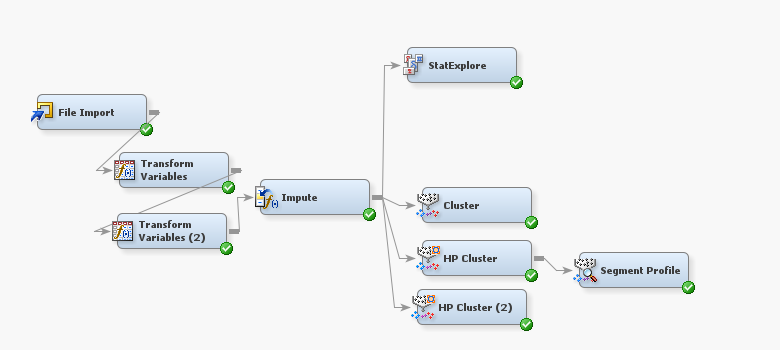

## <!-- fit --> Enhanced Precision in Anomaly Detection
### An Optimized k-Means Clustering Approach
 

- Huining Huang 

 

--- 

## Introduction
## Anomaly Detection: Methods & Applications

**Why It Matters:**
- Identifies errors, fraud, and new patterns in data.

**Key Methodologies:**
1. **Statistical Methods:** Spot deviations using statistical models.
2. **Machine Learning-Based Methods:** Supervised and unsupervised learning for complex data.
3. **Proximity-Based Methods:** Use distance metrics like DBSCAN for outlier detection.

**Applications Across Domains:**
- Finance, Industry, Cybersecurity.

**Considerations:**
- Balance between method complexity and data attributes.

*Sources: [11-16]*

--- 

**Literature Review**
## Clustering-Based Anomaly Detection: Overview & Methods

**Significance in Sectors:**
- Cybersecurity, Healthcare, Finance

**Primary Clustering Methods:**
- **Density-Based:** DBSCAN
- **Distribution-Based:** GMMs
- **Centroid-Based:** K-means
- **Connectivity-Based:** Hierarchical Clustering

**Method Highlights:**
- DBSCAN: Detects sparse points in dense regions [1].
- GMMs: Labels anomalies based on probabilistic distributions [2].
- K-means: Outliers far from centroids [3].
- Hierarchical: Small, detached cluster points [4].

*Sources: [1-4]*

--- 

## Clustering-Based Anomaly Detection: Analysis & Future

**Comparative Analysis:**
- Density vs. Distribution: Flexibility vs. Probabilistic Models [1][2].
- Centroid vs. Connectivity: Scalability vs. Detailed Structuring [3][4].

**Challenges & Practical Applications:**
- Scalability and Parameter Sensitivity.
- Interpretability in Complex Models [2][4].
- Utilized in Fraud Detection, Network Security [5][7].

**Research Gaps & Future Directions:**
- Real-time data stream integration and interpretability [10].
- Deep learning precision, e.g., Reverse Distillation [9].

*Sources: [1-10]*

---

## K-means Based Anomaly Detection Algorithm: Overview

**Anomaly Score:**
- Anomaly score \( A(x) \) defined by distance to cluster center, standard deviation, and density factor.

$
A(x) = \frac{D(x, C_i)}{\sigma(C_i) + \epsilon} \times \rho(C_i)
$

**Algorithm Steps:**
1. **Data Preprocessing:** Standardization and imputation.
2. **Determine Optimal Clusters \( k \):** Elbow method/silhouette score.
3. **Centroid Initialization:** Advanced methods (e.g., k-means++).
4. **Clustering Execution:** Using distance metric \( M \).
5. **Compute Cluster Properties:** Standard deviation \( \sigma(C_i) \) and density factor \( \rho(C_i) \).

*Algorithm continues on next slide...*

--- 

## K-means Based Anomaly Detection: Execution & Post-Processing

**Algorithm Steps Continued:**
6. **Anomaly Set Initiation:** Initialize an empty set for anomalies.
7. **Anomaly Scoring & Detection:**
   - Assign points to nearest cluster.
   - Calculate anomaly score.
   - Establish dynamic threshold \( T \).
   - Append outliers to anomaly set \( A \).
8. **Post-Processing:** Domain-specific filters or secondary model application.

**Threshold Strategy:**
- Dynamic threshold \( T = \alpha \times \text{median}\{A(D)\} \) or percentile-based.

**Post-Processing:**
- Enhances detection precision by mitigating false positives.

**Final Output:**
- Refined set of anomalies \( A \) based on defined criteria.

*End of Algorithm Presentation*

---

## Algorithmic Implementation and Cluster Analysis

 | 
--- | --- 

---

## Anomaly Detection Methodology
#### K-Means Anomaly Detection Framework

- Initial clustering with SAS Enterprise Miner
- Transition to Python for enhanced anomaly detection
- Anomaly score based on distance to centroid, cluster density, and deviation
- Dynamic thresholding to identify outliers
- 76 anomalies detected from the dataset

 $ A(x) = \frac{D(x, C_i)}{\sigma(C_i) + \epsilon} \times \rho(C_i) $, where $ D(x, C_i) $

---

**Insights from Anomaly Visualization**

- Dimensionality reduction using PCA for visualization
- Histogram of anomaly scores with threshold line
- Scatter plot: normal data vs. anomalies
- Anomaly distribution table by cluster
- Higher anomaly rates suggest potential subgroups

 | 
--- | --- 

| Cluster ID | Anomaly Count | Total Count | Anomaly Rate |
|------------|---------------|-------------|--------------|
| 1          | 49            | 141         | 34.75%       |
| 2          | 22            | 174         | 12.64%       |
| 3          | 5             | 191         | 2.62%        |

---

## Analysis of Anomalies in the Boston Housing Dataset

- **Attribute Contributions:**
  - High NOX levels in anomalies.
  - Unusual PTRATIO and RM indicating rarity.
  - Anomalies with lower TAX rates.

- **Practical Implications:**
  - Anomalies with higher MEDV values.
  - Varied CRIM rates among anomalies.
  
- **Algorithm Limitations:**
  - Sensitivity to attribute extremes.
  - Potential for false identifications.

- **Future Research:**
  - Importance of contextual analysis.
  - Need for integrated valuation approaches.

--- 

## References/Questions
- Citing relevant literature and studies referenced in the paper.
- Open floor for questions and further discussion.

---
