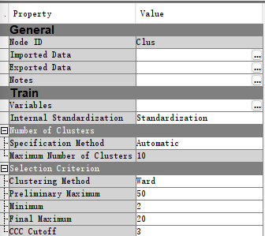

# INFS 5102 – Unsupervised Methods in Analytics
---
## Practical #4: Cluster Analysis (2)

**Data Overview**
The DUNGAREE dataset captures sales of four dungaree types across multiple stores within a specified time frame. The dataset comprises six columns: one for store identification and five detailing the sales numbers for each dungaree type.

---

**(a)** Create a project named Prac#4, and in the project, create a diagram named myPrac4.
**(b)** Create a data source with the DUNGAREE data set.

The project is designated as Prac#4, containing a diagram named myPrac4. A data source is created with the DUNGAREE dataset, as indicated in Table 1.

    
<strong>Table 1.</strong> Contents under project Prac#4 for question a. & b. .

  

--- 

**(c)** Determine whether the model roles and measurement levels assigned to the variables are appropriate.

The initial SAS-assigned roles for variables STOREID and SALESTOT were erroneous. STOREID should be categorized as a Nominal variable with its Model Role set to ID, as it is non-ordinal. SALESTOT was initially labeled as Input but has been reclassified to Rejected, due to its irrelevant role in clustering. The corrections are displayed in Table 2.

    
<strong>Table 2.</strong> The role and level assigned by SAS are corrected for this data source.

  

--- 
**(d)** Examine the distribution of the variables.
  - Are there any unusual data values? 
  - Are there missing values that should be replaced?

**Table 3.** Sample statistics for the variables in the DUNGAREE data set. There are no missing values.

| Obs# | Variable | Type  | Percent_Missing | Min  | Max   | Mean  |
|------|----------|-------|-----------------|------|-------|-------|
| 1    | FASHION  | VAR   | 0.0             | 1    | 204   | 92.3  |
| 2    | LEISURE  | VAR   | 0.0             | 650  | 2929  | 1916.4|
| 3    | ORIGINAL | VAR   | 0.0             | 823  | 2715  | 1849.4|
| 4    | SALESTOT | VAR   | 0.0             | 2140 | 4594  | 4302.1|
| 5    | STOREID  | VAR   | 0.0             | 1    | 689   | 345.0 |
| 6    | STRETCH  | VAR   | 0.0             | 2    | 1124  | 444.0 |

 
**Figure 1.** The distribution of the variables.

Table 3 provides descriptive statistics for each variable in the dataset, confirming a 0% missing value rate. The distribution plots in Figure 1 indicate no overtly unusual values for dungaree sales.  However the presence of three distinct clusters in the "SALESTOT" variable at 2200, 3300, and 4400 does deviate from the assumption of a normal distribution, which is often expected in many statistical analyses. Whether or not this is unusual largely depends on the business context. If the stores can be naturally divided into three different categories—such as size, location, or target market—that explain these clusters, then it may not be unusual.

---

**(e)** Assign the variable STOREID the model role ID and the variable SALESTOT the model role Rejected. Make sure that the remaining variables have the Input model role and the Interval 
measurement level. 
  - Why should the variable SALESTOT be rejected?

The Input model role and the Interval measurement level is addressed in question c.

In Section (c), the model roles and measurement levels were already corrected. STOREID is designated as ID since it serves as a unique identifier for stores. SALESTOT is rejected from analysis for its lack of relevance in clustering. The rest of the variables are tagged as Input and their measurement level is set as Interval, acknowledging their numerical nature.

---

**(f)** Drag the DUNGAREE data source to the diagram workspace to create an Input Data node for a process flow.

**(g)** Add a Cluster node to the diagram workspace and connect it to the Input Data node.

An Input Data node is created in the diagram workspace by dragging the DUNGAREE dataset into it. Following this, a Cluster node is added and connected to the Input Data node, as visualized in Figure 2.

**(h)** Select the Cluster node. Leave the default setting as Internal Standardization → Standardization. 
  - What would happen if inputs were not standardized?

 | 
--- | --- | --- 
**Figure 2.** step (f), (g) & (h).

If the inputs were not standardized before conducting cluster analysis, variables with larger numerical ranges or magnitudes could dominate the clustering process. This is because the distance metrics used in clustering algorithms are sensitive to scale. Variables with higher values might contribute disproportionately to the distance calculations, potentially overshadowing the influence of other variables with smaller values. Consequently, the resulting clusters might be biased towards the variables with larger scales, and the interpretation of the clusters could be misleading.

Standardization addresses this issue by scaling all variables to have the same mean and standard deviation. This ensures that variables with different scales contribute equally to the clustering process. Standardization facilitates a more accurate identification of clusters based on the inherent patterns within the data, rather than being influenced by the scale of individual variables.

Failure to standardize inputs would result in skewed clustering due to the disproportionate influence of variables with larger numerical ranges. Standardization equilibrates this by scaling all variables to a common mean and standard deviation, fostering a balanced contribution from all variables to the clustering process.

--- 

**(i)** Run the diagram from the Cluster node and examine the results.
  - Does the number of clusters created seem reasonable?

**Table 4.** Ward's Minimum Variance Cluster Analysis.

Eigenvalues of the Covariance Matrix
| Eigenvalue Index | Eigenvalue   | Difference   | Proportion | Cumulative |
|------------------|--------------|--------------|------------|------------|
| 1                | 152028.436   | 105072.935   | 0.6438     | 0.6438     |
| 2                | 46955.501    | 10703.237    | 0.1989     | 0.8427     |
| 3                | 36252.264    | 35362.121    | 0.1535     | 0.9962     |
| 4                | 890.143      |              | 0.0038     | 1.0000     |

**Figure 3.** Segmentation of the DUNGAREE data set into 20 clusters.

20 clusters could potentially overfit the data, unless each variable can legitimately create multiple segments. The eigenvalues in the output suggest that the first three dimensions capture most of the variance (99.62%). If most of the variance can be explained by fewer dimensions, it could imply that fewer clusters might also provide a meaningful segmentation.

Table 4 and Figure 3 show that the initial analysis generates an excessive 20 clusters. Given that the first three dimensions account for approximately 99.62% of the variance, a smaller number of clusters could still capture most of the data structure.

---

**(j)**  Specify a maximum of six clusters and rerun the Cluster node. How does the number and quality of clusters compare to that obtained in part h?

**Figure 4.** Segmentation of the DUNGAREE data set into 6 clusters.

There is a shift in variable importance suggests that reducing the number of clusters brings out different priorities or relationships among the variables. A reduced number of clusters generally leads to larger, less specific clusters, they might be easier to interpret and act upon. The risk of overfitting is also reduced with fewer clusters, making the model potentially more generalizable.The choice between 6 and 20 clusters would likely depend on the specific use-case and what is aim to achieve with the clustering.

Upon restricting the clusters to a maximum of six, the model produces different variable relationships, as indicated in Figure 4. Fewer clusters generally yield broader but more interpretable categories, mitigating the risk of overfitting and enhancing model generalizability.

---

**(k)** Segment Profile node to summarize the nature of the clusters.
  - What are the nature/characteristics of each of the 6 clusters, respectively?

**Figure 5.** The cluster profile for the clusters 1.

- This cluster deviates significantly from the overall distribution, particularly excelling in ORIGINAL variables while lagging in LEISURE. This indicates a preference for original, perhaps classic, dungaree styles over leisure-oriented ones.
  

**Figure 6.** The cluster profile for the clusters 2.

- Cluster 2 diverges notably in STRETCH and LEISURE variables. Its low score in FASHION variables suggests that this group prioritizes comfort over style.

**Figure 7.** The cluster profile for the clusters 3.

- This cluster shows a radical deviation, exhibiting a near-zero presence in the STRETCH variable. Coupled with its low frequency count, this suggests a small, niche group that disapproves of stretch material in dungarees.

**Figure 8.** The cluster profile for the clusters 4.

- High scores in the LEISURE variable indicate that this cluster prefers dungarees suited for leisure activities. The cluster deviates from the overall distribution mainly in this aspect.

**Figure 9.** The cluster profile for the clusters 5.

- This cluster registers high in FASHION variables, while trailing in others, revealing a fashion-forward focus. The deviation from the overall distribution here is stark.

**Figure 10.** The cluster profile for the clusters 6.

- Remarkably aligned with the overall distribution, this cluster appears balanced across all variables. Given its high frequency count, it is likely the most representative of the overall customer base.

**(l)** Use the Reporter node to produce a report as part of Practical #4 submission.