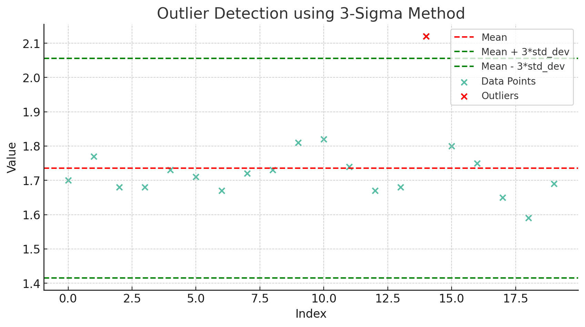
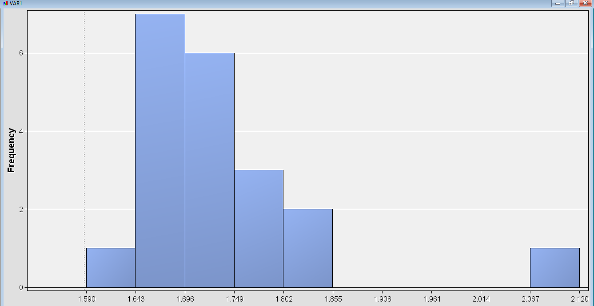
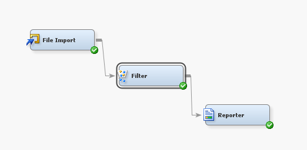
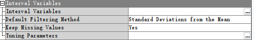
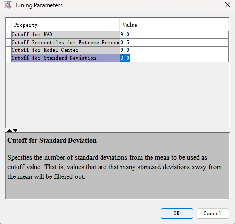

# INFS 5102 – Unsupervised Methods in Analytics
---
## Practical #7: Anomaly Detection

**1. Assume that the given data follows a normal distribution. Use the 3-sigma method to detect if there are outliers in this dataset. List the outlier(s) and present the steps in your answer (e.g.,how you calculated / what approach you used to detect the outlier(s)). (Hint: calculate the mean and standard deviation of the data set and decide the outlier using the individual value’s z-score)**

**Methodology**

The 3-sigma method employs the following steps:

1. **Calculate Mean and Standard Deviation**: The average (\( \mu \)) and standard deviation (\( \sigma \)) of the dataset are calculated.
  
  \[
  \text{Mean} (\mu) = \frac{\sum{x}}{n}
  \]
  
  \[
  \text{Standard Deviation} (\sigma) = \sqrt{\frac{\sum{(x - \mu)^2}}{n}}
  \]
  
2. **Compute Z-score**: The Z-score for each data point \( x \) is calculated using the formula:
  
  \[
  Z = \frac{x - \mu}{\sigma}
  \]

3. **Identify Outliers**: Data points with an absolute Z-score greater than 3 are considered outliers.

**Analysis**

**Calculate Mean and Standard Deviation**

After loading the dataset, the mean and standard deviation were calculated to be:

- Mean (\( \mu \)) = 1.7355
- Standard Deviation (\( \sigma \)) = 0.107

**Compute Z-score**

The Z-score for each data point was calculated using the formula mentioned above.

**Identify Outliers**

Upon computing the Z-scores, it was found that a single data point with a value of 2.12 had a Z-score of approximately 3.600, thereby qualifying as an outlier as per the 3-sigma rule.

**Visualization Explanation**

The plot visualizes the data points, the mean (red dashed line), and the 3-sigma bounds (green dashed lines). The outlier is highlighted in red.

- **Data Points**: Represented as blue dots.
- **Mean**: The red dashed line indicates the mean value (\( \mu = 1.7355 \)).
- **3-Sigma Bounds**: The green dashed lines indicate \( \mu \pm 3\sigma \).
- **Outliers**: Highlighted in red, the outlier has a value of \( 2.12 \).

**Figure 1.** Data points and the identified outlier. The red x that above the \( \mu \pm 3\sigma \) represent the outlier in the data.

The 3-sigma method was employed to detect an outlier in the dataset. The outlier has a value of \( 2.12 \) and a Z-score of approximately \( 3.600 \), which exceeds the 3-sigma threshold. 

--- 

**2. Within SAS Enterprise Miner, the Filter node can be used to remove outliers from a data set using the 3-Sigma method. Import the given dataset to SAS Enterprise Miner and learn to use the Filter node to identify and remove outlier(s) from the given dataset with the 3-sigma method.**

In SAS Enterprise Miner, the Filter node facilitates outlier detection and removal. The workflow diagram and data point distribution are illustrated below:

 | 
:---: | :---:

**Figure 2.** Distribution of the data points (left) and the diagram of the workflow (right).

---

**3. To apply the 3-Sigma method to remove outlier(s) from the given dataset using the Filter node, how would you set up the Filter node?**

The Filter node was configured with precision to apply the 3-Sigma method for outlier detection. The setup screenshots are as follows:

 | 
:---: | :---:

**Figure 3.** The Filter node setup (left) and the 3-sigma method setup (right).

**Parameters and Settings**

- Standard Deviations from the Mean: Set to 3.

This setting is crucial for implementing the 3-Sigma method. By setting the threshold to 3 standard deviations, we align the methodology with the 3-Sigma rule. This parameter quantifies how many standard deviations a data point can be from the mean before it is considered an outlier.